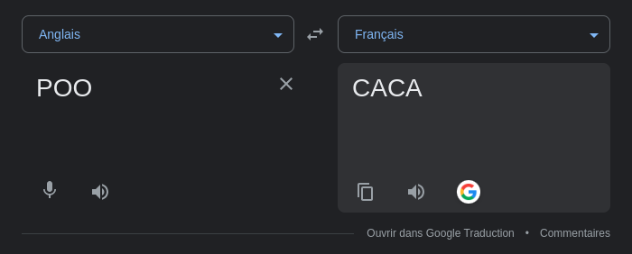

# Programmation orientée objet

La Programmation Orientée Objet (POO) est un paradigme de programmation qui organise le code autour de "classes" et d'"objets". Ces classes servent de modèles pour créer des objets, qui sont des instances de ces classes.


plus d'infos: [ici](http://193.49.249.136:20180/~web/terminale/poo_voc.php) et [ici](http://193.49.249.136:20180/~web/terminale/poo_intro.php)

```py
class Voiture:
	def __init__(self, nom, km):
		self.nom = nom
        self.km = km

    def get_kilométrage(self):
        return self.km
    def get_nom(self):
        return self.nom

ma_voiture = Voiture("Clio 2",10000)
print(ma_voiture.get_kilométrage())
print(ma_voiture.get_nom())
# note en python on peut également faire 
print(ma_voiture.nom)
print(ma_voiture.km)
# mais c'est une mauvaise pratique car on ne peut pas le faire dans tout les languages et en principe l'objet est une boite noire
```