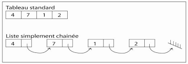
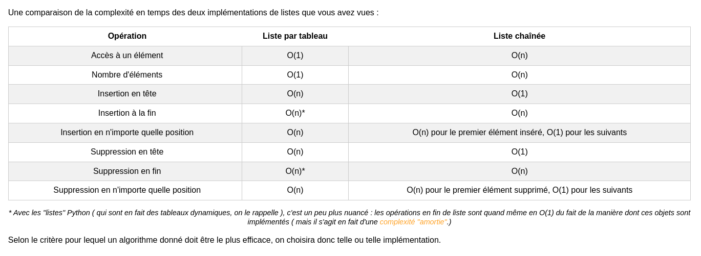

# La liste chainé

En python les "list" sont en réalité des tableaux standards




[plus d'infos](http://nsivaugelas.free.fr/terminale/listes.php)


## implémentation récursive avec une seule classe

```py
class ListeChaineeRecursive:
    def __init__(self, valeur=None, suivant=None):
        """
        Initialise une liste chaînée avec une valeur et l'élément suivant.
        
        Args:
            valeur: La valeur à stocker dans cet élément (par défaut None pour une liste vide).
            suivant: L'élément suivant dans la liste (par défaut None).
        """
        self.valeur = valeur
        self.suivant = suivant

    def ajouter(self, valeur):
        """
        Ajoute un élément à la liste chaînée.
        
        Args:
            valeur: La valeur à ajouter.
        """
        if self.valeur is None:
            self.valeur = valeur
        elif self.suivant is None:
            self.suivant = ListeChaineeRecursive(valeur)
        else:
            self.suivant.ajouter(valeur)

    def retirer_a_index(self, index, precedent=None):
        """
        Retire l'élément à l'index spécifié de la liste chaînée.
        
        Args:
            index: L'index de l'élément à retirer.
            precedent: L'élément précédent (par défaut None).
        """
        if self.valeur is None:
            return
        
        if index == 0:
            if precedent is not None:
                precedent.suivant = self.suivant
            else:
                if self.suivant is None:
                    self.valeur = None
                else:
                    self.valeur = self.suivant.valeur
                    self.suivant = self.suivant.suivant
        elif self.suivant is not None:
            self.suivant.retirer_a_index(index - 1, self)

    def longueur(self):
        """
        Calcule la longueur de la liste chaînée.
        
        Returns:
            int: La longueur de la liste.
        """
        if self.valeur is None:
            return 0
        elif self.suivant is None:
            return 1
        else:
            return 1 + self.suivant.longueur()

    def afficher(self):
        """
        Affiche les éléments de la liste chaînée.
        """
        courant = self
        while courant is not None:
            if courant.valeur is not None:
                print(courant.valeur, end=" -> ")
            courant = courant.suivant
        print("None")

# Exemple d'utilisation
liste = ListeChaineeRecursive()
liste.ajouter(10)
liste.ajouter(20)
liste.ajouter(30)

liste.afficher()
liste.retirer_a_index(1)
liste.afficher()

```


## code de la liste chainé implémentation avec les noeuds

```py
class Noeud:
    def __init__(self, donnee):
        """
        Initialise un nœud avec une donnée spécifiée.
        
        Args:
            donnee: La donnée à stocker dans le nœud.
        """
        self.donnee = donnee
        self.suivant = None

class ListeChainee:
    def __init__(self):
        """
        Initialise une liste chaînée vide.
        """
        self.tete = None

    def ajouter(self, donnee):
        """
        Ajoute un élément à la fin de la liste chaînée.
        
        Args:
            donnee: La donnée à ajouter.
        """
        pass

    def retirer_a_index(self, index):
        """
        Retire l'élément à l'index spécifié de la liste chaînée.
        
        Args:
            index: L'index de l'élément à retirer.
        """
        pass

    def longueur(self):
        """
        Calcule la longueur de la liste chaînée.
        
        Returns:
            int: La longueur de la liste.
        """
        pass

    def afficher(self):
        """
        Affiche les éléments de la liste chaînée.
        """
        pass

        
```
[correction](liste_cor.md)
